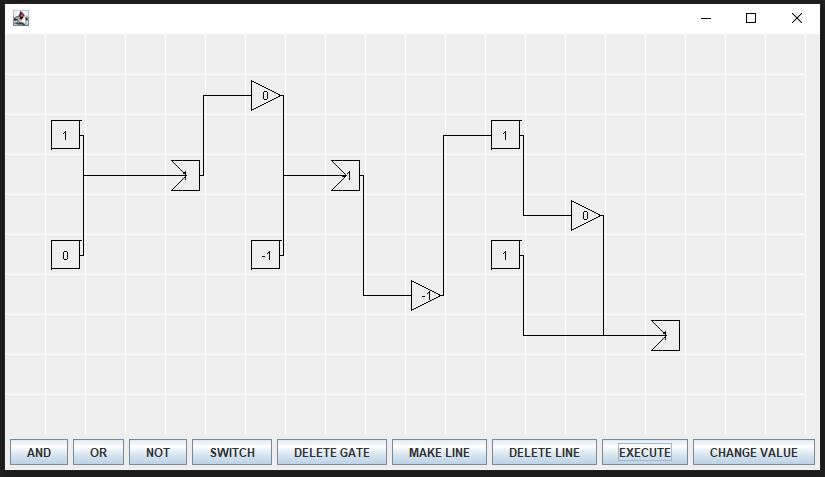

# Digital Logic Circuit Simulator

A Java-based graphical application for building and simulating digital logic circuits. Create logic gates (AND, OR, NOT) and switches on a grid, connect them with wires, and test your circuits.



## Installing Java

1. Go to [Oracle's Java Downloads](https://www.oracle.com/java/technologies/downloads/)
2. Download the JDK installer for Windows
3. Run the installer and follow the setup wizard
4. Verify installation by opening Command Prompt and typing:
   ```cmd
   javac -version
   java -version
   ```

## Running the Program

1. **Compile the code:**
   ```cmd
   javac *.java
   ```
   *Note: Deprecation warnings are normal and won't affect the program.*

2. **Run the program:**
   ```cmd
   java CircuitTest
   ```

3. **Using the interface:**
   - Click gate buttons (AND, OR, NOT, SWITCH) then click on the grid to place them
   - Use "MAKE LINE" to connect gates from left to right
   - Use "CHANGE VALUE" to set input values (0 or 1)
   - Click "EXECUTE" to run your circuit and see the output
